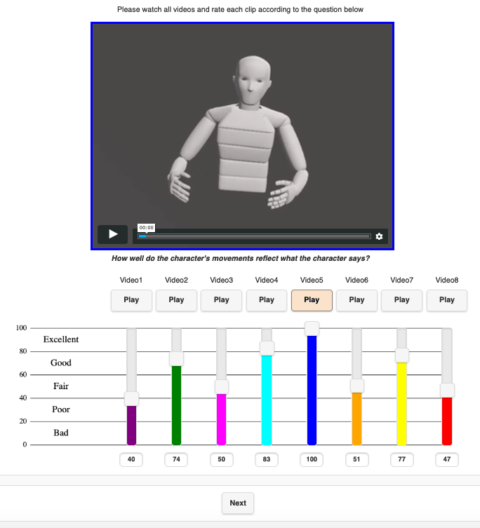

# HEMVIP
<p align="center">
  
</p>

## Introduction

Stimuli tests with videos are often used in the field of non verbal behavior generation. From the field of audio listening tests, we have adapted the [webMUSHRA.js Software](https://github.com/audiolabs/webMUSHRA) to make it possible to use the software for the simultaneous assessment of videos.
This tool currently works with [Prolific](https://prolific.co/) but should be easy to adapt to other platforms or run as stand-alone. Read more about the prolific settings in the configuration section.

### GENEA 2022 Branch

Currently, this repository contains two branches. The master branch is the official HEMVIP release repository. For the GENEA 2022 challenge, some changes (see features) have been made to address issues with pairwise testing and rating. The GENEA 2022 branch has been tested and used for the challenge, and comes with the same license.

### Download

Currently, it is required to clone this repository to get started.

## Features

* Ability to test with videos, and include attention checks
* Handles rejections based on attention checks
* Saves data to mongodb
* Allows for showing a questionannaire or custom html content as pages

## Features (GENEA 2022 Branch)

* Pairwise video testing (see doc/experimenter.md)
* Attention checks with automatic failure detection

## Supported Browsers

 * Google Chrome, Firefox on Windows, Mac and Linux

### Docker

You can use docker to set up HEMVIP quickly. Just run
`docker-compose -f docker-compose.yml build` to build the HEMVIP docker container.

To run the container use `docker-compose -f docker-compose.yml up`. We configured the docker image so that the `configs`  folder is mounted inside the container so that you can modify it on the fly.

In order to assess the results that are stored in the MongoDB, you need to either use the `docker-compose_dev.yml` file or add the relevant ports to the original file.
This way, you can access the database and export the experimental results. 

#### Note for Docker on Windows

When using Docker Toolbox/Machine on Windows, volume paths (to mount the `configs` and `results` folder) are not converted by default. To enable this conversion set the environment variable COMPOSE_CONVERT_WINDOWS_PATHS=1 e.g. by `env:COMPOSE_CONVERT_WINDOWS_PATHS=1` in the power shell.

#### Change or add a configuration

HEMVIP uses [JSON](https://en.wikipedia.org/wiki/JSON) to configure experiments. We recommend to use an editor to work with JSON files.
Place your configuration in the `configs/my_first_experiment` folder. Your configuration is now available under the following link (with fake IDs, these can be retreived from Prolific and are used to save the results in the Mongo DB):

`localhost:80/prolific/my_first_experiment?PROLIFIC_PID=1234567&STUDY_ID=1234567&SESSION_ID=123123`

## Documentation

 * [Experimenters Manual](doc/experimenter.md)

## Citation

```
@inproceedings{jonell_2021_hemvip,
author = {Jonell, Patrik and Yoon, Youngwoo and Wolfert, Pieter and Kucherenko, Taras and Henter, Gustav Eje},
title = {HEMVIP: Human Evaluation of Multiple Videos in Parallel},
year = {2021},
isbn = {9781450384810},
publisher = {Association for Computing Machinery},
address = {New York, NY, USA},
url = {https://doi.org/10.1145/3462244.3479957},
doi = {10.1145/3462244.3479957},
abstract = { In many research areas, for example motion and gesture generation, objective measures
alone do not provide an accurate impression of key stimulus traits such as perceived
quality or appropriateness. The gold standard is instead to evaluate these aspects
through user studies, especially subjective evaluations of video stimuli. Common evaluation
paradigms either present individual stimuli to be scored on Likert-type scales, or
ask users to compare and rate videos in a pairwise fashion. However, the time and
resources required for such evaluations scale poorly as the number of conditions to
be compared increases. Building on standards used for evaluating the quality of multimedia
codecs, this paper instead introduces a framework for granular rating of multiple
comparable videos in parallel. This methodology essentially analyses all condition
pairs at once. Our contributions are 1) a proposed framework, called HEMVIP, for parallel
and granular evaluation of multiple video stimuli and 2) a validation study confirming
that results obtained using the tool are in close agreement with results of prior
studies using conventional multiple pairwise comparisons.},
booktitle = {Proceedings of the 2021 International Conference on Multimodal Interaction},
pages = {707–711},
numpages = {5},
keywords = {evaluation paradigms, gesture generation, conversational agents, video evaluation},
location = {Montr\'{e}al, QC, Canada},
series = {ICMI '21}
}
```


## Copyright/Licence
Please see LICENSE.txt and THIRD-PARTY-NOTICES.txt
